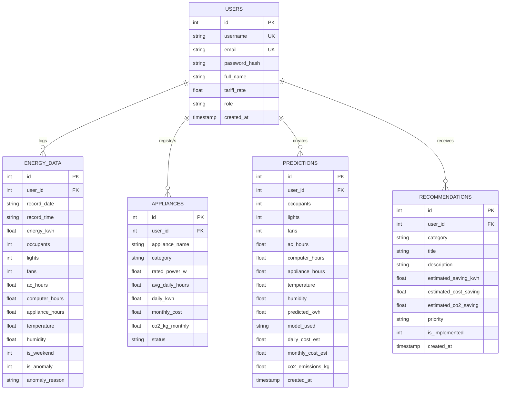

# AI-Based Energy Consumption Prediction & Sustainable Energy Recommendation System

[](https://www.python.org/)
[](https://flask.palletsprojects.com/)
[](https://scikit-learn.org/)
[](LICENSE)
[-brightgreen.svg)]()

> A full-stack, software-only Computer Science & Engineering (CSE) academic project that leverages machine learning to forecast electricity consumption, detect energy-wasting appliances via statistical outlier analysis, compute progressive tiered tariffs and carbon emissions ($CO_2$), and provide personalized sustainability recommendations.

---

## 📌 Project Overview

* **Title**: AI-Based Energy Consumption Prediction and Sustainable Energy Recommendation System
* **Domain**: Artificial Intelligence, Machine Learning, Data Science, Sustainable Computing, Web Engineering
* **Project Type**: 100% Software-Based (No physical hardware, sensors, ESP32, Arduino, Raspberry Pi, or IoT cloud dependencies required)
* **Target Audience**: B.Tech / BE / MCA / M.Tech CSE Academic Submissions & Demonstrations

---

## 🌟 Key Features

1. **User Authentication & Role Management**: Secure password hashing (Werkzeug/bcrypt), user sessions, profile customization, and individual tariff rates (₹/kWh).
2. **Energy Telemetry & Data Management**: Upload historical or simulated CSV datasets, enter single-entry manual readings, preview dataset structures, and download templates.
3. **Multi-Model Machine Learning Engine**:
   - Compares **Linear Regression**, **Decision Tree**, **Random Forest**, and **Gradient Boosting**.
   - Evaluates performance via **MAE**, **RMSE**, **$R^2$ Score**, and **MAPE (%)**.
   - Side-by-side interactive simulation sliders with real-time AJAX recalculations.
   - Actual vs Predicted ground-truth verification line charts.
4. **Appliance-Level Anomaly & Energy Waste Detection**:
   - Statistical Z-score & IQR outlier analysis.
   - Identifies abnormal spikes and faulty/excessive operational runtimes (e.g. AC running during low temperatures, continuous resistive water heater loads).
5. **Progressive Tiered Tariff & Financial Billing**:
   - Instant daily, monthly, and annual electricity cost estimates based on multi-tier slab pricing.
6. **Carbon Footprint & Ecological Equivalents**:
   - Estimates $CO_2$ emissions (standard grid emission factor $0.82\text{ kg } CO_2/\text{kWh}$).
   - Computes tree planting offset equivalents and passenger vehicle distance equivalents.
7. **Personalized Sustainable Recommendation Engine**:
   - Rule-based and pattern-driven algorithms generate prioritized recommendations (High/Medium/Low) with quantifiable kWh and currency savings.
8. **Printable Audit Reports**:
   - Comprehensive energy audit reports ready for direct printing or saving as PDF.

---

## 🗂️ Project Structure

```text
SEE/
├── app.py                     # Main Flask Application & HTTP Route Controller
├── requirements.txt           # Python Dependencies
├── database.db                # Auto-generated SQLite Database
├── init_db.py                 # SQLite Schema Setup & Seed Data Loader
├── train_model.py             # ML Model Training & Comparison Pipeline
├── ml_engine.py               # ML Algorithms, Scalers & Evaluation Metrics
├── prediction.py              # ML Inference Engine & Feature Preprocessor
├── recommendation.py          # Sustainable Recommendations Engine
├── energy_calculator.py       # Tariff Billing & Carbon CO2 Calculator
├── anomaly_detector.py        # Statistical Outlier & Appliance Waste Detector
├── test_app.py                # Automated Unit & Integration Test Suite
├── dataset/
│   ├── generate_dataset.py    # Simulated Realistic Dataset Generator
│   └── energy_data.csv        # 1,200+ Simulated Hourly Records
├── models/
│   ├── energy_model.pkl       # Serialized Best Machine Learning Model
│   ├── all_models.pkl         # Multi-Model Ensemble Bundle
│   └── model_metrics.json     # Saved Benchmark Evaluation Scores (MAE, RMSE, R²)
├── templates/
│   ├── base.html              # Master UI Layout with Theme Switcher
│   ├── login.html             # User Sign-In with Demo Account Helper
│   ├── register.html          # User Registration & Tariff Configuration
│   ├── dashboard.html         # Executive Dashboard with Chart.js
│   ├── upload.html            # CSV Ingestion & Manual Reading Form
│   ├── prediction.html        # Interactive AI Forecast Sliders & Verifications
│   ├── analysis.html          # Exploratory Data Analytics & Telemetry Table
│   ├── appliances.html        # Appliance Inventory & Anomaly Logs
│   ├── recommendations.html   # Sustainable Action Cards & Savings Tracker
│   ├── reports.html           # Printable Energy Audit & Billing Report
│   └── profile.html           # User Profile & Tariff Customizer
└── static/
    ├── css/
    │   └── style.css          # Glassmorphism & Eco-Tech CSS Design System
    └── js/
        ├── charts.js          # Chart.js Visualizations Manager
        └── dashboard.js       # Theme Switcher & Real-Time AJAX Prediction Engine
```

---

## 🛠️ Technology Stack

| Layer | Technologies Used |
|---|---|
| **Backend** | Python 3, Flask 3.0, Werkzeug (Password Security) |
| **Database** | SQLite3 (Relational Schema with Foreign Keys) |
| **Machine Learning & Data** | Scikit-Learn, NumPy, Pandas, Custom ML Engine (GBR, RF, DT, LR) |
| **Frontend** | HTML5, CSS3 (Vanilla Glassmorphism Design System), JavaScript (ES6+) |
| **UI Frameworks** | Bootstrap 5.3, Bootstrap Icons |
| **Data Visualizations** | Chart.js 4.4 (Time-Series, Diurnal Bar Charts, Doughnut, Multi-Line) |

---

## ⚙️ Installation & Setup (Windows & VS Code)

### 1. Prerequisites
- Python 3.9 or higher installed on your system ([python.org](https://www.python.org/downloads/)).
- Visual Studio Code or any modern code editor.

### 2. Open Project in VS Code
Open VS Code, press `Ctrl + O` or navigate to `File -> Open Folder...` and select the `SEE` project directory.

### 3. Open Terminal in VS Code
Press `Ctrl + ~` (or `Terminal -> New Terminal`).

### 4. Install Dependencies
Run:
```powershell
pip install -r requirements.txt
```

### 5. Initialize Database & Seed Benchmark Data
Run:
```powershell
python init_db.py
```

### 6. Train the Machine Learning Models
Run:
```powershell
python train_model.py
```

### 7. Run the Automated Test Suite (Optional Verification)
Run:
```powershell
python test_app.py
```

### 8. Start the Web Application
Run:
```powershell
python app.py
```

Open your browser and visit:
👉 **[http://127.0.0.1:5000](http://127.0.0.1:5000)**

---

## 🔑 Demo Login Credentials

You can use the built-in demo credentials (or click the quick autofill buttons on the login page):

* **Standard Demo User**:
  - Username: `demo_user`
  - Password: `password123`
* **Administrator**:
  - Username: `admin`
  - Password: `admin123`

---

## 📊 Database Schema



---

## 🔬 Machine Learning Evaluation Results

| Algorithm | Mean Absolute Error (MAE) | Root Mean Squared Error (RMSE) | $R^2$ Score | Mean Absolute % Error (MAPE) |
|---|---|---|---|---|
| **Gradient Boosting Regressor** | **0.0770** | **0.1224** | **0.8943** | **11.35%** |
| **Decision Tree Regressor** | 0.1084 | 0.1590 | 0.8217 | 15.25% |
| **Random Forest Regressor** | 0.0929 | 0.1655 | 0.8069 | 12.63% |
| **Linear Regression (OLS / Ridge)** | 0.0944 | 0.1815 | 0.7678 | 12.12% |

---

## 🎓 Academic Report Documentation

A full academic writeup containing the **Abstract**, **Problem Statement**, **Objectives**, **Existing vs Proposed Systems**, **System Architecture**, **Methodology**, **Advantages**, **Limitations**, **Future Enhancements**, and **Conclusion** is provided in [PROJECT_DOCUMENTATION.md](PROJECT_DOCUMENTATION.md).
>>>>>>> 2130276 ( Initial EcoAI Project)
